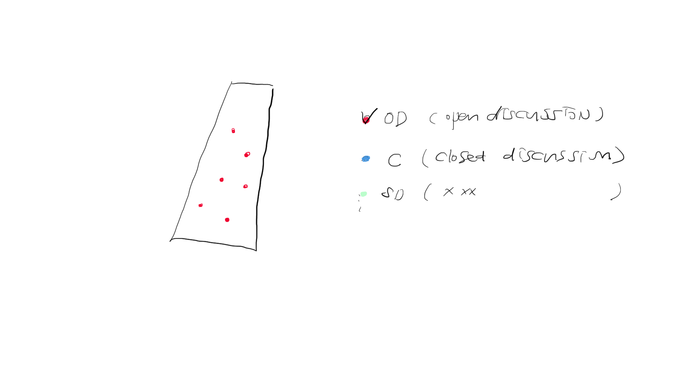

The stored data has 
- day
- location name
- street name
- coordinates information
- Meeting Time
- Meeting type

Total five elements are available.
I picked the coordination and the Meeting Type.
Meeting type will be sorted by DOM Evenet on the map.

Radio button or Check boxes would toggle on/off the meetings depending on the meeting types.

The different typs are represented by the different colors.

