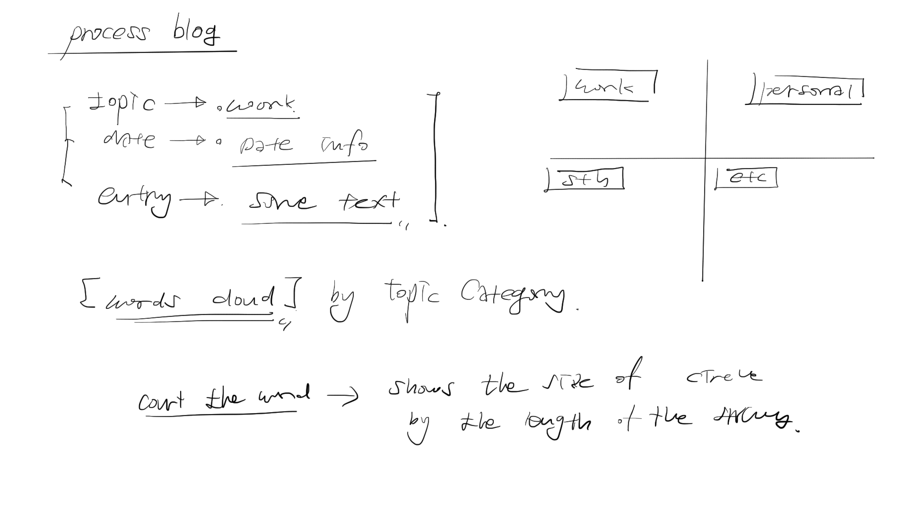
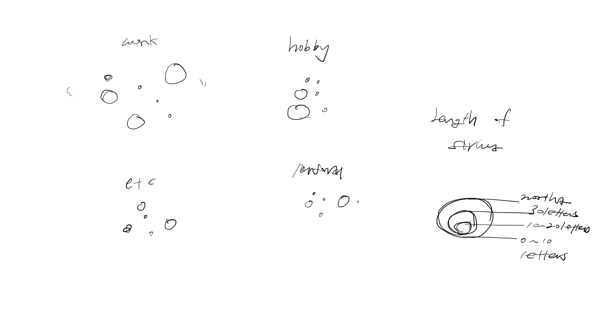
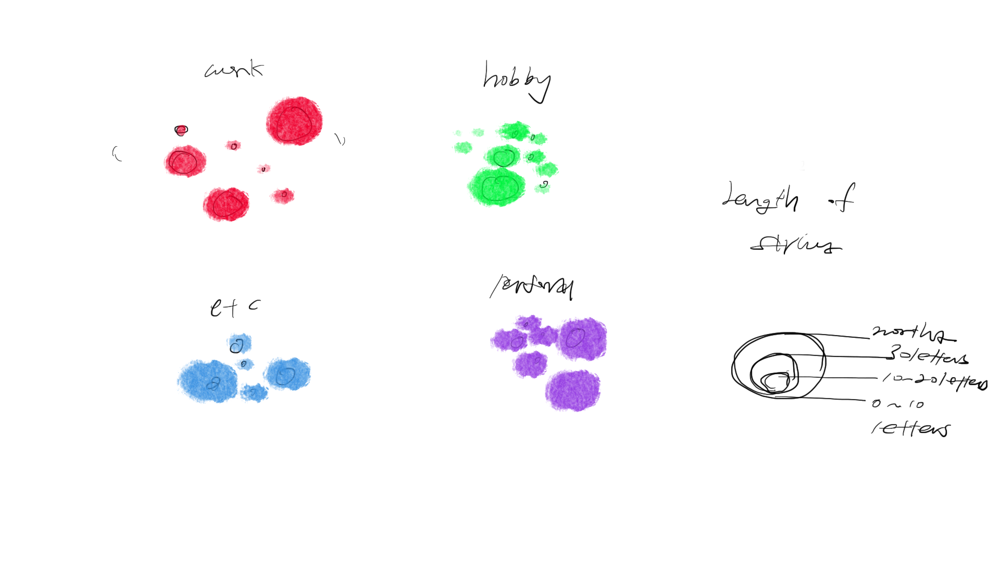

In the process blog data, mainly three information are available.
The first information is topic of each entity and the second is the date for the entity and lastly the contents itself.

The possible visualization would be 
- Quantitative approach toward the LENGTH of the string.
- Categorical approach for the topic like different color coding for different topics
- Lastly the quantitative approach for the dates.

I finally landed on the two attributes which arae the length of the string and the topics of the entity.

The size of the circles is represented by the length of the contents string.

And each topic will have its own colors to differentiate itself from the others. The Circles would float around the area by using d3 force layout.

